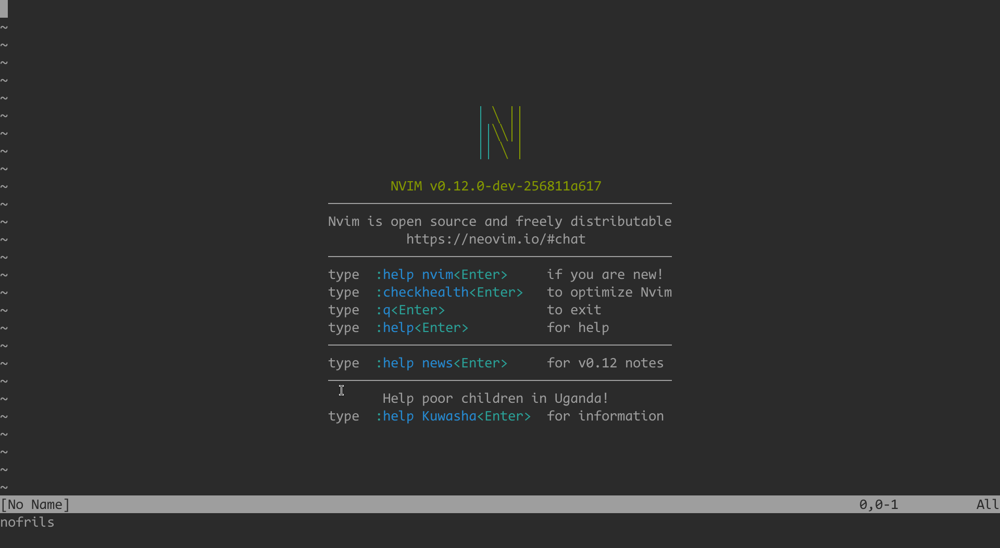
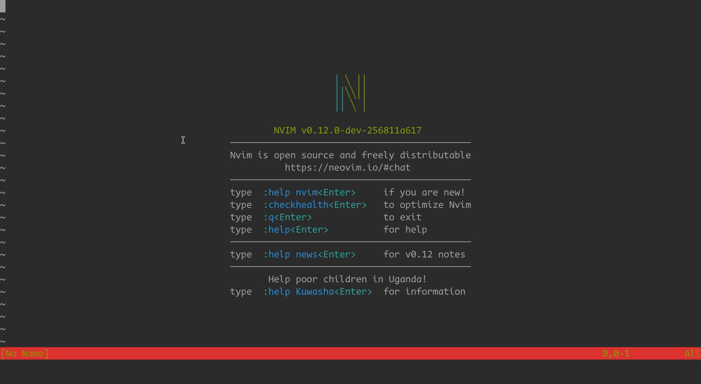
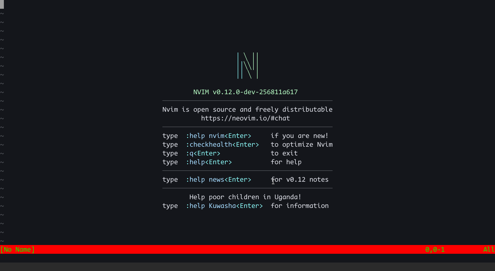
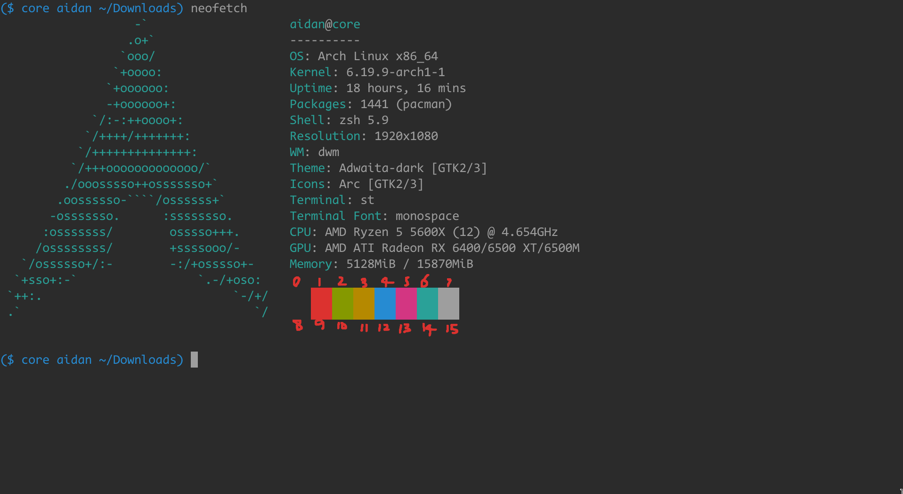
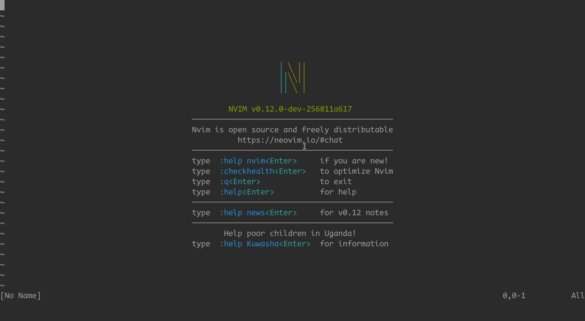
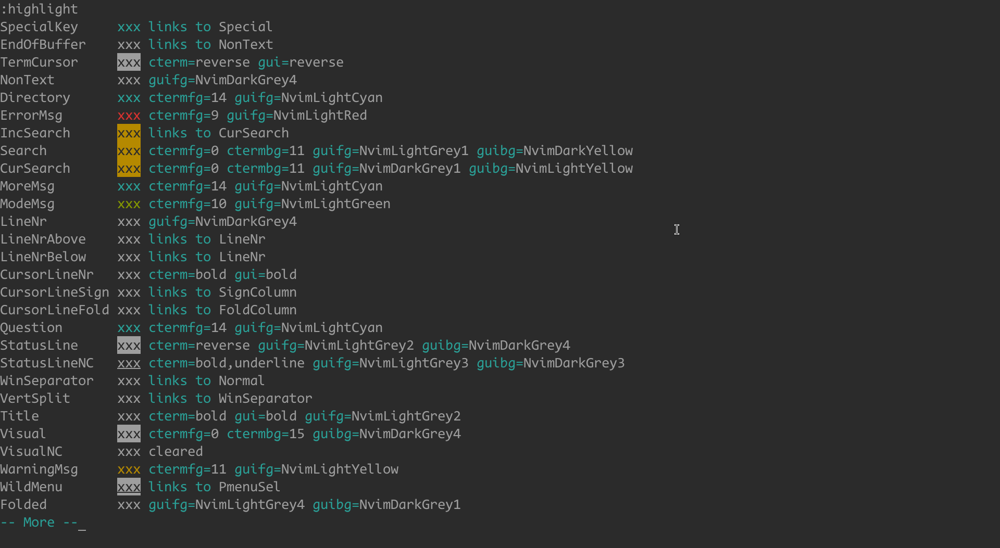
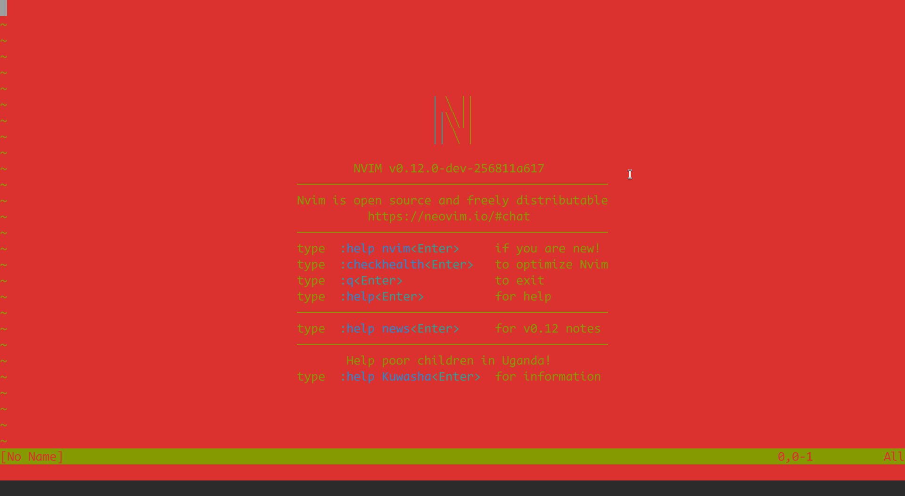
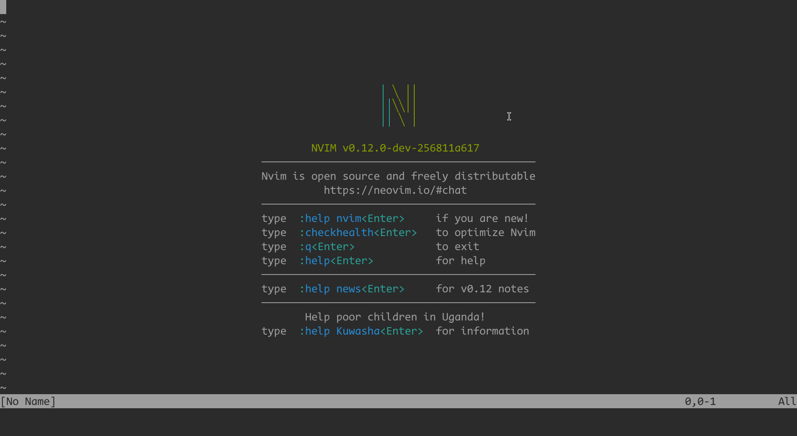
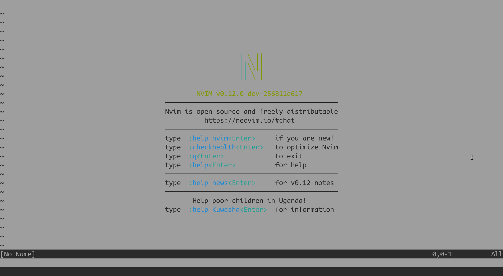
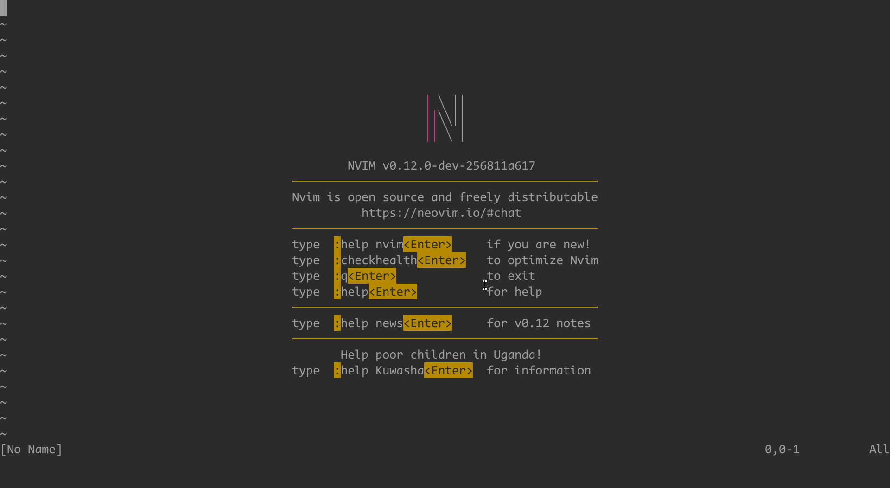

nofrils.nvim - build your own neovim colorscheme from scratch, make every color opt-in

# preface

colorschemes these days tend to use more and more colors

it seems that many people shy away from white text on a black background

but the question is, do we actually need all these colors?

i was impressed by this video: https://www.youtube.com/watch?v=IXBC85SGC0Q

in the video, the linux kernel developer just uses the original vi, yet he appears completely at ease using it

i once got really tired of all these colors, then i discovered this minimal vim colorscheme plugin:

https://github.com/robertmeta/nofrils

i forked it and adapted it to my own preferences, which eventually became the repository you are viewing now

although the name is the same, the content is no longer related to that vim plugin

in fact, this repo contains nothing but the markdown file you are currently viewing, which will guide you in building a colorscheme from the ground up

# preparation

to experiment without touching your own config, we use a different appname (`:help $NVIM_APPNAME`)

namely, create `~/.config/nvim_nofrils` dir, then create `~/.config/nvim_nofrils/init.lua` file

populate `init.lua` with the following content:

```lua
print("nofrils")
-- print "nofrils" in the bottom-left corner
```

after that, you can launch neovim with `NVIM_APPNAME=nvim_nofrils nvim`

and restart neovim with the `:restart` command (`:help :restart`)



# highlight group

neovim's colors are controlled by highlight groups, for example:

populate `init.lua` with:

```lua
vim.o.termguicolors = false
vim.api.nvim_set_hl(0, "StatusLine", {ctermbg = 1, ctermfg = 2})
```

`:restart` neovim, you should see:



populate `init.lua` with:

```lua
vim.o.termguicolors = true
vim.api.nvim_set_hl(0, "StatusLine", {bg = "#ff0000", fg = "#00ff00"})
```

`:restart` neovim, you should see:



as you can see

we changed the color of the statusline by modifying the `StatusLine` highlight group, setting the background to red and the foreground to green

but why do the colors look different in the two cases?

the key issue lies in the `termguicolors` option

## if you set `termguicolors` to false (the first example)

you are essentially telling neovim to use only the 16 colors provided by your terminal

> to be precise, 256 colors, but only the first 16 colors are defined by the terminal
> https://en.wikipedia.org/wiki/ANSI_escape_code#Colors

you can use `neofetch` to view the 16 colors:



we set `ctermbg` to `1`, which means that we want to use terminal color 1 as the background color when `termguicolors` is false

> ctermbg: shorthand for "color terminal background"

the same applies to `ctermfg`

so `ctermbg` and `ctermfg` correspond to `termguicolors=false`

## if you set `termguicolors` to true (the second example)

you are essentially telling neovim to use any colors specified via "#rrggbb"

> [!NOTE]
> but you cannot use the terminal 16 colors in this situation

we set `bg` to `#ff0000`, which means that we want to use the color `#ff0000` as the background color when `termguicolors` is true

the same applies to `fg`

so `bg` and `fg` correspond to `termguicolors=true`

## you can specify both `ctermbg` and `bg` at the same time:

populate `init.lua` with:

```lua
vim.api.nvim_set_hl(0, "StatusLine", {ctermbg = 1, ctermfg = 2, bg = "#ff0000", fg = "#00ff00"})
```

then the actual color depends on `termguicolors`

# the `Normal` highlight group

now, populate `init.lua` with:

```lua
vim.o.termguicolors = false
vim.api.nvim_set_hl(0, "StatusLine", {})
```

`:restart` neovim:



now the statusline appears with a black background and white foreground. what happened?

in this example, we set the `statusline` highlight group to an empty table `{}`, which means it falls back to the default highlight group: `Normal`

you can view all highlight groups via `:highlight`:



among all highlight groups, the most important and special one is `Normal`

the `Normal` highlight group controls how normal text looks and serves as the fallback highlight group

if you do not specify an attribute for a highlight group, or set it to "NONE", it will fall back to the corresponding attribute of the normal highlight group

this example can also be written as:

```lua
vim.o.termguicolors = false
vim.api.nvim_set_hl(0, "StatusLine", {ctermbg = "NONE", ctermfg = "NONE", bg = "NONE", fg = "NONE"})
```

## specify `Normal` highlight group

populate `init.lua` with:

```lua
vim.o.termguicolors = false
vim.api.nvim_set_hl(0, "Normal", {ctermbg = 1, ctermfg = 2})
```

alright... this looks very brutal



## `Normal` highlight group and `vim.o.background`

for most people, you typically want:

```lua
vim.o.termguicolors = false
vim.api.nvim_set_hl(0, "Normal", {ctermbg = 0, ctermfg = 7})
```

usually, terminal color 0 is black, and terminal color 7 is white:



if you want a light theme:

```lua
vim.o.termguicolors = false
vim.api.nvim_set_hl(0, "Normal", {ctermbg = 7, ctermfg = 0})
```



vim provides the `background` option to switch between the dark and light variants of a theme

from a theme's perspective, it is simply:

```lua
if vim.o.background == "dark" then
	vim.api.nvim_set_hl(0, "Normal", {ctermbg = 0, ctermfg = 7})
else
	vim.api.nvim_set_hl(0, "Normal", {ctermbg = 7, ctermfg = 0})
end
```

> however, i do not use this mechanism myself
>
> i always set ctermbg=0 and ctermfg=7
>
> i modify terminal colors instead
>
> for a dark theme, i set 0 to black and 7 to white
>
> for a light theme, i set 0 to white and 7 to black

# the `link` attribute

we can create our own themes now:

populate `init.lua` with:

```lua
vim.o.termguicolors = false

vim.api.nvim_set_hl(0, "Normal", {ctermbg = 0, ctermfg = 7})
vim.api.nvim_set_hl(0, "StatusLine", {ctermbg = 4, ctermfg = 0})
vim.api.nvim_set_hl(0, "Visual", {ctermbg = 4, ctermfg = 0})
vim.api.nvim_set_hl(0, "Search", {ctermbg = 4, ctermfg = 0})
```

the `StatusLine`, `Visual`, and `Search` highlight group share the same spec, yet we repeat it three times in our colorscheme, which is inconvenient

we can use this instead:

```lua
vim.o.termguicolors = false

vim.api.nvim_set_hl(0, "Normal", {ctermbg = 0, ctermfg = 7})
vim.api.nvim_set_hl(0, "StatusLine", {ctermbg = 4, ctermfg = 0})
vim.api.nvim_set_hl(0, "Visual", {link = "StatusLine"})
vim.api.nvim_set_hl(0, "Search", {link = "StatusLine"})
```

`link = "StatusLine"` means we use the exactly same spec as `StatusLine`

we can take it even further:

```lua
vim.o.termguicolors = false

vim.api.nvim_set_hl(0, "Normal", {ctermbg = 0, ctermfg = 7})

vim.api.nvim_set_hl(0, "nofrils_blue_bg", {ctermbg = 4, ctermfg = 0})

vim.api.nvim_set_hl(0, "StatusLine", {link = "nofrils_blue_bg"})
vim.api.nvim_set_hl(0, "Visual", {link = "nofrils_blue_bg"})
vim.api.nvim_set_hl(0, "Search", {link = "nofrils_blue_bg"})
```

`nofrils_blue_bg` is a custom highlight group whose sole purpose is to serve as a link target for other groups

using `link`, a few highlight groups can define neovim's entire look

using `link`, a theme can be changed dynamically<br>
for example, setting `nofrils_blue_bg` to solarized blue makes the theme solarized, using gruvbox blue makes it gruvbox

> [!CAUTION]
> you cannot use `link` for `Normal` highlight group

# the full nofrils colorscheme

populate `init.lua` with:

```lua
vim.o.termguicolors = false

-- # clear definition of all existing highlight groups

for name, _ in pairs(vim.api.nvim_get_hl(0, {})) do
	vim.api.nvim_set_hl(0, name, {})
end

-- # prevent `vim.api.nvim_set_hl` from modifying highlight groups, use `_G.nvim_set_hl` instead

if _G.nvim_set_hl == nil then
	_G.nvim_set_hl = vim.api.nvim_set_hl
	vim.api.nvim_set_hl = function(ns_id, name, _)
		_G.nvim_set_hl(ns_id, name, {})
	end
end

-- # color palette when `termguicolors` is true

local g = {
	color0 = "#2b2b2b", -- for light variant, use "#cdcdcd"
	color1 = "#dc322f",
	color2 = "#859900",
	color3 = "#b58900",
	color4 = "#268bd2",
	color5 = "#d33682",
	color6 = "#2aa198",
	color7 = "#9e9e9e", -- for light variant, use "#525252"
}

-- # define `Normal` highlight group

nvim_set_hl(0, "Normal", {ctermbg = 0, ctermfg = 7, bg = g.color0, fg = g.color7})

-- # define basic highlight groups that can be linked later

nvim_set_hl(0, "nofrils_black",      {ctermbg = "NONE", ctermfg = 0, bg = "NONE",   fg = g.color0})
nvim_set_hl(0, "nofrils_red",        {ctermbg = "NONE", ctermfg = 1, bg = "NONE",   fg = g.color1})
nvim_set_hl(0, "nofrils_green",      {ctermbg = "NONE", ctermfg = 2, bg = "NONE",   fg = g.color2})
nvim_set_hl(0, "nofrils_yellow",     {ctermbg = "NONE", ctermfg = 3, bg = "NONE",   fg = g.color3})
nvim_set_hl(0, "nofrils_blue",       {ctermbg = "NONE", ctermfg = 4, bg = "NONE",   fg = g.color4})
nvim_set_hl(0, "nofrils_magenta",    {ctermbg = "NONE", ctermfg = 5, bg = "NONE",   fg = g.color5})
nvim_set_hl(0, "nofrils_cyan",       {ctermbg = "NONE", ctermfg = 6, bg = "NONE",   fg = g.color6})
nvim_set_hl(0, "nofrils_white",      {ctermbg = "NONE", ctermfg = 7, bg = "NONE",   fg = g.color7})
nvim_set_hl(0, "nofrils_black_bg",   {ctermbg = 0,      ctermfg = 7, bg = g.color0, fg = g.color7})
nvim_set_hl(0, "nofrils_red_bg",     {ctermbg = 1,      ctermfg = 0, bg = g.color1, fg = g.color0})
nvim_set_hl(0, "nofrils_green_bg",   {ctermbg = 2,      ctermfg = 0, bg = g.color2, fg = g.color0})
nvim_set_hl(0, "nofrils_yellow_bg",  {ctermbg = 3,      ctermfg = 0, bg = g.color3, fg = g.color0})
nvim_set_hl(0, "nofrils_blue_bg",    {ctermbg = 4,      ctermfg = 0, bg = g.color4, fg = g.color0})
nvim_set_hl(0, "nofrils_magenta_bg", {ctermbg = 5,      ctermfg = 0, bg = g.color5, fg = g.color0})
nvim_set_hl(0, "nofrils_cyan_bg",    {ctermbg = 6,      ctermfg = 0, bg = g.color6, fg = g.color0})
nvim_set_hl(0, "nofrils_white_bg",   {ctermbg = 7,      ctermfg = 0, bg = g.color7, fg = g.color0})

nvim_set_hl(0, "nofrils_reverse",     {reverse = true})
nvim_set_hl(0, "nofrils_transparent", {blend = 100, nocombine = true})
nvim_set_hl(0, "nofrils_underline",   {underline = true, sp = g.color7})

-- # define core highlight groups
-- for detailed information, run `:help highlight-groups`

nvim_set_hl(0, "CurSearch",      {link = "nofrils_blue_bg"})
nvim_set_hl(0, "Cursor",         {})
nvim_set_hl(0, "CursorColumn",   {link = "nofrils_reverse"})
nvim_set_hl(0, "CursorLine",     {link = "nofrils_reverse"})
nvim_set_hl(0, "CursorLineFold", {link = "nofrils_reverse"})
nvim_set_hl(0, "CursorLineNr",   {link = "nofrils_reverse"})
nvim_set_hl(0, "CursorLineSign", {link = "nofrils_reverse"})
nvim_set_hl(0, "DiffAdd",        {link = "nofrils_green"})
nvim_set_hl(0, "DiffChange",     {link = "nofrils_yellow"})
nvim_set_hl(0, "DiffDelete",     {link = "nofrils_red"})
nvim_set_hl(0, "DiffText",       {link = "nofrils_blue"})
nvim_set_hl(0, "ErrorMsg",       {link = "nofrils_red"})
nvim_set_hl(0, "FloatBorder",    {})
nvim_set_hl(0, "Folded",         {link = "nofrils_yellow_bg"})
nvim_set_hl(0, "IncSearch",      {link = "nofrils_white_bg"})
nvim_set_hl(0, "LineNr",         {})
nvim_set_hl(0, "LineNrAbove",    {})
nvim_set_hl(0, "LineNrBelow",    {})
nvim_set_hl(0, "MatchParen",     {link = "nofrils_yellow_bg"})
nvim_set_hl(0, "NonText",        {link = "nofrils_yellow"})
nvim_set_hl(0, "Pmenu",          {})
nvim_set_hl(0, "PmenuSbar",      {})
nvim_set_hl(0, "PmenuSel",       {link = "nofrils_reverse"})
nvim_set_hl(0, "PmenuThumb",     {link = "nofrils_reverse"})
nvim_set_hl(0, "QuickFixLine",   {})
nvim_set_hl(0, "Search",         {link = "nofrils_blue_bg"})
nvim_set_hl(0, "SpecialKey",     {link = "nofrils_yellow_bg"})
nvim_set_hl(0, "StatusLine",     {})
nvim_set_hl(0, "TabLine",        {})
nvim_set_hl(0, "TabLineFill",    {})
nvim_set_hl(0, "TabLineSel",     {link = "nofrils_reverse"})
nvim_set_hl(0, "TermCursor",     {})
nvim_set_hl(0, "Visual",         {link = "nofrils_blue_bg"})
nvim_set_hl(0, "WarningMsg",     {link = "nofrils_yellow"})
nvim_set_hl(0, "Whitespace",     {link = "nofrils_yellow"})
nvim_set_hl(0, "WinSeparator",   {})
nvim_set_hl(0, "lCursor",        {})

-- # define syntax highlight groups
-- for detailed information, run `:help group-name`

nvim_set_hl(0, "Added",   {link = "nofrils_green"})
nvim_set_hl(0, "Changed", {link = "nofrils_yellow"})
nvim_set_hl(0, "Comment", {link = "nofrils_blue"})
nvim_set_hl(0, "Error",   {link = "nofrils_red_bg"})
nvim_set_hl(0, "Removed", {link = "nofrils_red"})
nvim_set_hl(0, "Special", {link = "nofrils_magenta"})

-- # define treesitter highlight groups
-- for detailed information, run `:help treesitter-highlight-groups`

nvim_set_hl(0, "@comment",          {link = "nofrils_blue"})
nvim_set_hl(0, "@diff.delta",       {link = "nofrils_yellow"})
nvim_set_hl(0, "@diff.minus",       {link = "nofrils_red"})
nvim_set_hl(0, "@diff.plus",        {link = "nofrils_green"})
nvim_set_hl(0, "@markup.heading.1", {link = "nofrils_red"})
nvim_set_hl(0, "@markup.heading.2", {link = "nofrils_red"})
nvim_set_hl(0, "@markup.heading.3", {link = "nofrils_red"})
nvim_set_hl(0, "@markup.heading.4", {link = "nofrils_red"})
nvim_set_hl(0, "@markup.heading.5", {link = "nofrils_red"})
nvim_set_hl(0, "@markup.heading.6", {link = "nofrils_red"})
nvim_set_hl(0, "@markup.link",      {link = "nofrils_cyan"})
nvim_set_hl(0, "@markup.raw",       {link = "nofrils_blue"})
```

then `:restart`:



## categorize the highlight groups

- category 1: core highlight groups

	fundamental highlight groups, like `Statusline` and `Normal`

	see `:help highlight-groups`

- category 2: syntex highlight groups

	highlight groups used for regex-based syntax highlighting

	see `:help group-name`

- category 3: neovim-specific highlight groups

	highlight groups for treesitter, lsp, diagnostics, etc

- category 4: user-defined highlight groups

	for example, `FzfLuaCursorLine`

the default values for categories 1-3 can be found at: `neovim/src/nvim/highlight_group.c`, they are considered as builtin

because categories 1-2 have existed for a long time, many highlight groups link to them (or use them directly), for example, the new intro message in version 0.12

## the goal of nofrils

the goal of nofrils is to eliminate all colors and only add them when necessary

that is why we did something unusual at the beginning of `init.lua`

if we do want to modify a highlight group, we can:

```lua
nvim_set_hl(0, "FzfLuaCursorLine", {link = "nofrils_reverse"})
```

## modular our colorscheme

everything we do so far is done in `init.lua`

to make it easier to manage, we can modularize our colorscheme

namely:

in `init.lua`:

```lua
vim.o.termguicolors = false
require("nofrils")
```

in `~/.config/nvim_nofrils/lua/nofrils.lua`:

```lua
<everything else goes here>
```

but with this approach, `:colorscheme nofrils` won't work, and the `ColorScheme` autocmd won't be triggered

if you don't mind, you can keep using this approach, else:

in `init.lua`:

```lua
vim.o.termguicolors = false
vim.cmd("colorscheme nofrils")
```

in `~/.config/nvim_nofrils/colors/nofrils.lua`

```lua
<everything else goes here>
```

# congratulations! our colorscheme is complete!

you can copy the relevant parts into your own configuration and keep adjusting them as your preferences evolve

# use xresources colors

`~/.config/nvim_nofrils/lua/nofrils_x.lua`:

<details>

```lua
-- # xrdb (x server resource database utility)

-- https://github.com/nekonako/xresources-nvim/blob/master/lua/xresources.lua
-- https://github.com/martineausimon/nvim-xresources/blob/main/lua/nvim-xresources/system.lua

local M = {}

M.get_xrdb_query = function()
	local str = io.popen("xrdb -query", "r"):read("*a")
	local lis = vim.split(str, "\n", {trimempty = true})
	local tbl = {}
	for _, i in ipairs(lis) do
		local kv = vim.split(i, ":\t")
		local k = kv[1]
		local v = kv[2]
		tbl[k] = v
	end
	return tbl
end

M.color = {
	"color0",
	"color1",
	"color2",
	"color3",
	"color4",
	"color5",
	"color6",
	"color7",
	"color8",
	"color9",
	"color10",
	"color11",
	"color12",
	"color13",
	"color14",
	"color15",
}

M.tbl_find = function(t, pattern)
	for k, v in pairs(t) do
		if string.find(k, pattern) then
			return v
		end
	end
	return nil
end

M.get_xrdb_color = function()
	local xrdb_query = M.get_xrdb_query()
	local xrdb_color = {}
	for _, color in ipairs(M.color) do
		local pattern = color .. "$"
		xrdb_color[color] = M.tbl_find(xrdb_query, pattern)
	end
	return xrdb_color
end

return M
```

</details>

`nofrils.lua`:

```lua
local g = require("nofrils_x").get_xrdb_color()
```
